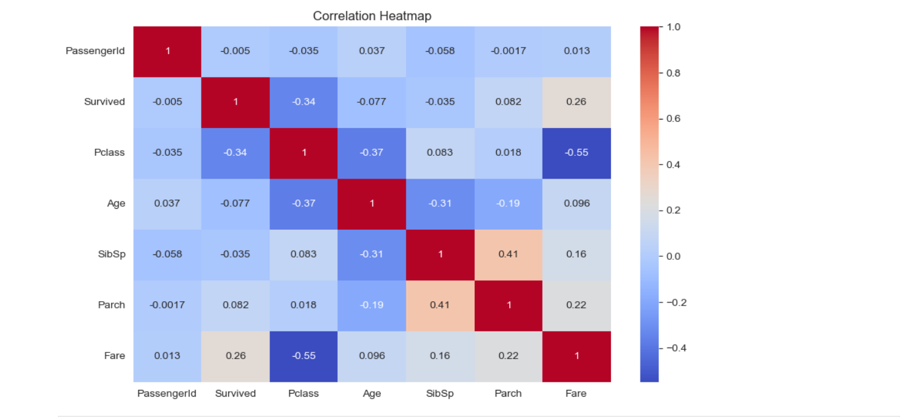
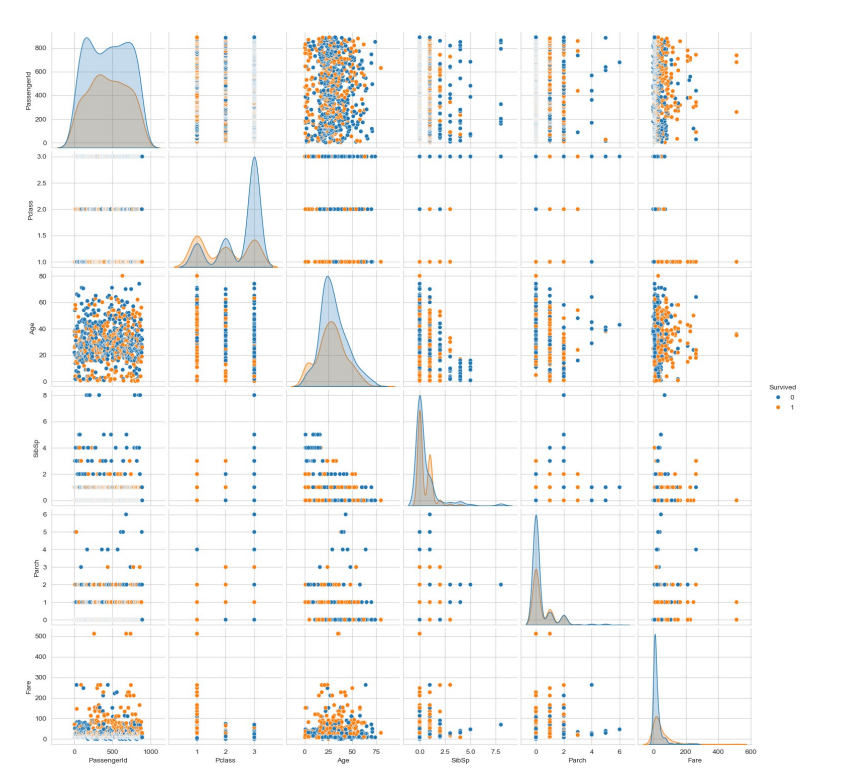
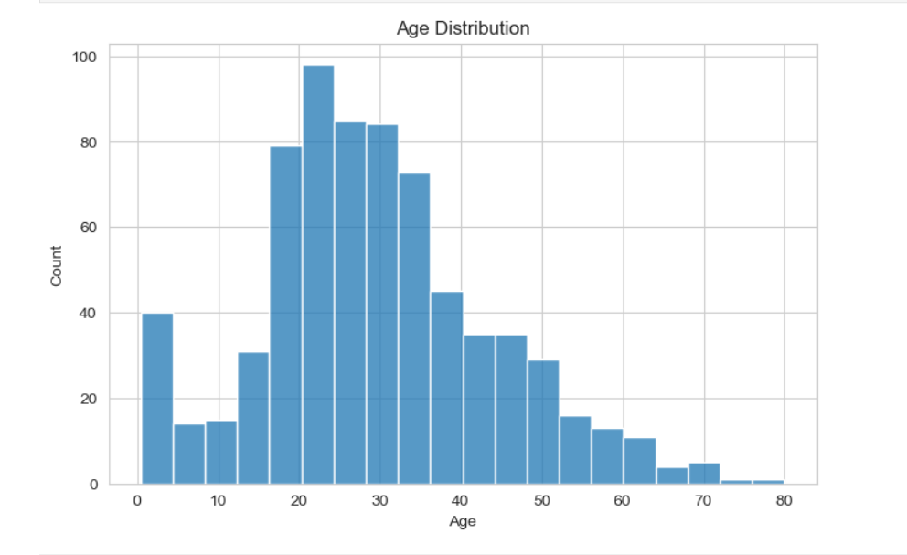
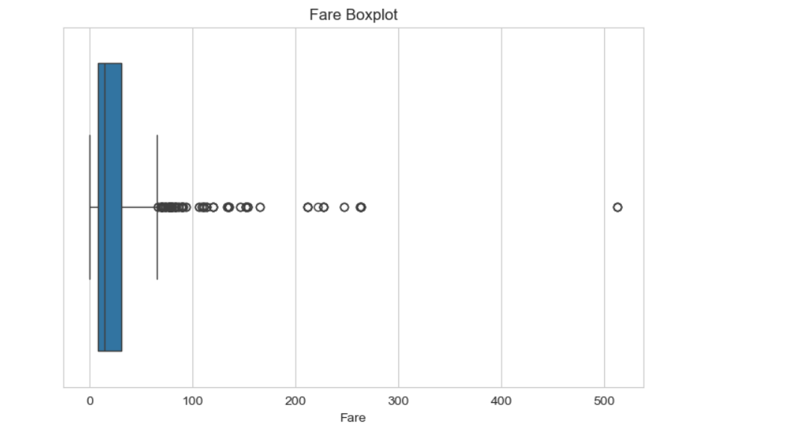
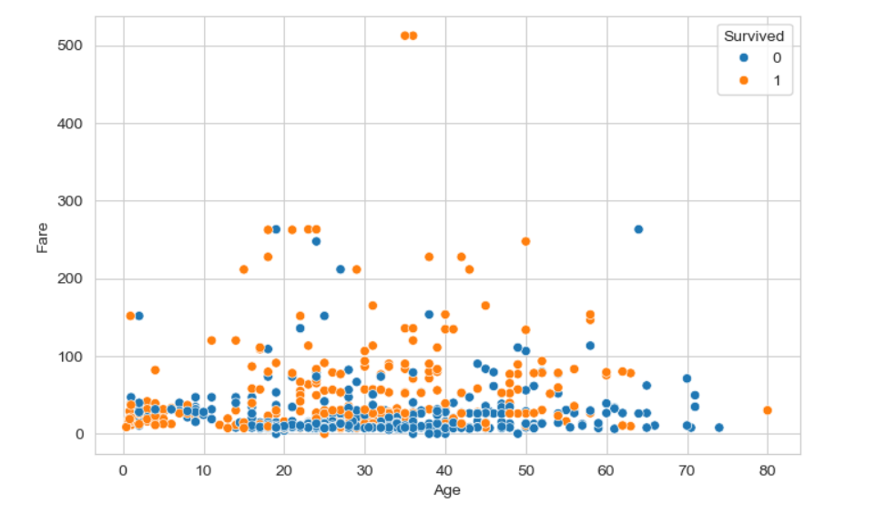
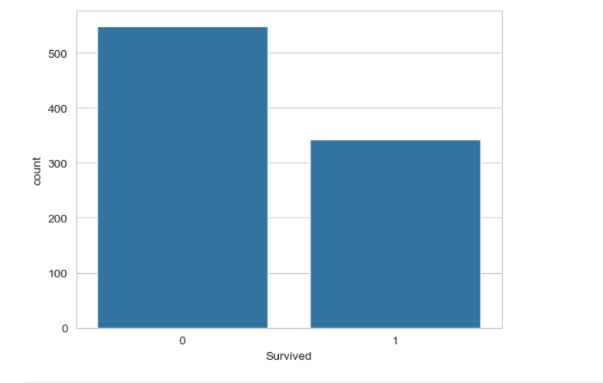
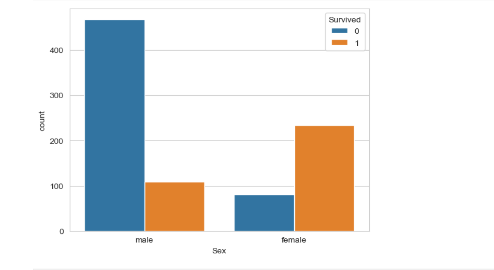
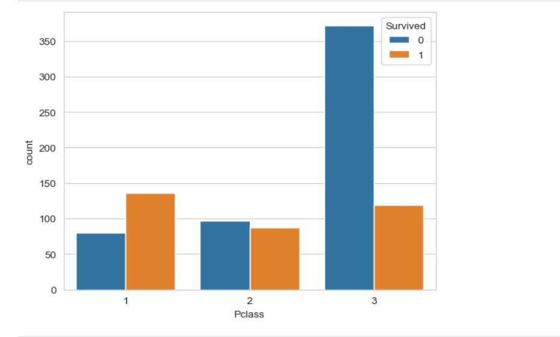
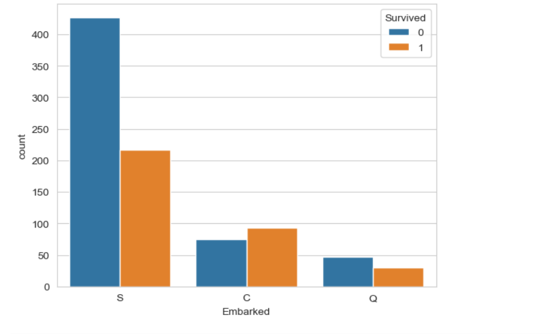
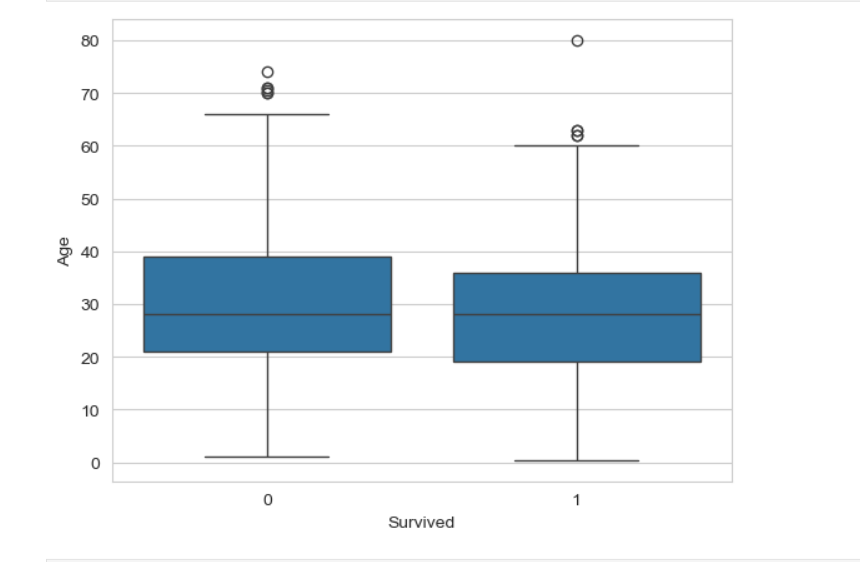

<h1 align="center">🚢 Exploratory Data Analysis (EDA) - Titanic Dataset</h1>

  
  
  
  
  

<h2>📌 Project Overview</h2>

This project demonstrates <b>Exploratory Data Analysis (EDA)</b> using the
<b>Titanic Dataset</b>. The objective is to understand the dataset through
statistical analysis and visual exploration, identify patterns and trends,
detect missing values and outliers, and discover the factors that influenced
passenger survival.

EDA is an essential step in the data analysis process as it helps in
understanding data before applying machine learning models.

<h2>🎯 Objective</h2>

<ul>
  <li>Understand the structure of the dataset.</li>
  <li>Explore numerical and categorical features.</li>
  <li>Identify missing values and duplicate records.</li>
  <li>Analyze relationships between different variables.</li>
  <li>Detect trends and patterns using visualizations.</li>
  <li>Identify outliers in numerical data.</li>
  <li>Write observations for each visualization.</li>
  <li>Summarize the overall findings.</li>
</ul>

<h2>🛠️ Tools & Libraries Used</h2>

<ul>
  <li>Python</li>
  <li>Pandas</li>
  <li>NumPy</li>
  <li>Matplotlib</li>
  <li>Seaborn</li>
  <li>Jupyter Notebook</li>
</ul>

<h2>📂 Dataset Information</h2>

<b>Dataset Name:</b> Titanic Dataset

<ul>
  <li><b>Number of Records:</b> 891</li>
  <li><b>Number of Features:</b> 12</li>
</ul>

<b>Features:</b>

<ul>
  <li>PassengerId</li>
  <li>Survived</li>
  <li>Passenger Class (Pclass)</li>
  <li>Name</li>
  <li>Sex</li>
  <li>Age</li>
  <li>SibSp</li>
  <li>Parch</li>
  <li>Ticket</li>
  <li>Fare</li>
  <li>Cabin</li>
  <li>Embarked</li>
</ul>

<h2>📊 Exploratory Data Analysis Steps</h2>

<h3>1. Data Loading</h3>

<ul>
  <li>Imported required libraries.</li>
  <li>Loaded the Titanic dataset using Pandas.</li>
  <li>Displayed the first, last, and random records.</li>
</ul>

<h3>2. Dataset Understanding</h3>

<b>Performed:</b>

<ul>
  <li>df.head()</li>
  <li>df.tail()</li>
  <li>df.sample()</li>
  <li>df.shape()</li>
  <li>df.info()</li>
</ul>

<b>Purpose:</b>

<ul>
  <li>Understand dataset size</li>
  <li>Check feature names</li>
  <li>Identify data types</li>
</ul>

<h3>3. Statistical Analysis</h3>

<b>Used:</b> df.describe()

<ul>
  <li>Mean</li>
  <li>Median</li>
  <li>Minimum</li>
  <li>Maximum</li>
  <li>Standard Deviation</li>
  <li>Quartiles</li>
</ul>

<h3>4. Missing Value Analysis</h3>

<b>Used:</b> df.isnull().sum()

<b>Findings:</b>

<ul>
  <li>Age contains missing values.</li>
  <li>Cabin contains a large number of missing values.</li>
  <li>Embarked contains a few missing values.</li>
</ul>

<h3>5. Duplicate Data Check</h3>

<b>Used:</b> df.duplicated().sum()

<b>Result:</b> No duplicate records were found.

<h3>6. Frequency Analysis</h3>

<b>Used:</b> value_counts()

<b>Analyzed:</b>

<ul>
  <li>Survival</li>
  <li>Gender</li>
  <li>Passenger Class</li>
  <li>Embarked</li>
</ul>

<h2>📈 Visualizations</h2>

<ul>
  <li>Correlation Heatmap</li>
  <li>Pair Plot</li>
  <li>Age Histogram</li>
  <li>Fare Histogram</li>
  <li>Fare Boxplot</li>
  <li>Age Boxplot</li>
  <li>Scatter Plot (Age vs Fare)</li>
  <li>Survival Count Plot</li>
  <li>Gender Count Plot</li>
  <li>Gender vs Survival</li>
  <li>Passenger Class Count Plot</li>
  <li>Passenger Class vs Survival</li>
  <li>Embarked Count Plot</li>
  <li>Embarked vs Survival</li>
  <li>Age vs Survival Boxplot</li>
  <li>SibSp Count Plot</li>
  <li>Parch Count Plot</li>
</ul>

Each visualization includes observations explaining the insights obtained from the data.

The following visualizations were created to analyze the dataset.

<h3>🔥 Correlation Heatmap</h3>

Shows the relationship between numerical features.

  

<h3>📊 Pair Plot</h3>

Displays pairwise relationships between numerical variables grouped by survival.

  

<h3>📉 Age Distribution</h3>

Shows the age distribution of passengers.

  

<h3>📦 Fare Box Plot</h3>

Identifies fare outliers.

  

<h3>📍 Scatter Plot (Age vs Fare)</h3>

Illustrates the relationship between passenger age and ticket fare.

  

<h3>🚢 Survival Count Plot</h3>

Shows the number of survivors and non-survivors.

  

<h3>👨👩 Gender vs Survival</h3>

Compares survival rates between male and female passengers.

  

<h3>🎫 Passenger Class vs Survival</h3>

Displays survival rates across passenger classes.

  

<h3>⚓ Embarked vs Survival</h3>

Shows survival distribution based on embarkation port.

  

<h3>👶 Age vs Survival</h3>

Compares age distribution between survivors and non-survivors.

<h2>📌 Key Findings</h2>

<ul>
  <li>The dataset contains 891 passenger records and 12 features.</li>
  <li>Missing values are present in the Age, Cabin, and Embarked columns.</li>
  <li>Most passengers traveled in Third Class.</li>
  <li>Male passengers were more than female passengers.</li>
  <li>Female passengers had a significantly higher survival rate.</li>
  <li>First Class passengers had better survival rates than Third Class passengers.</li>
  <li>Most passengers were between 20 and 40 years old.</li>
  <li>Fare distribution is highly right-skewed with several outliers.</li>
  <li>Passenger Class, Gender, and Fare show stronger relationships with survival than Age.</li>
</ul>

<h2>📋 Conclusion</h2>

Exploratory Data Analysis helped identify important characteristics of the
Titanic dataset. Through statistical summaries and visualizations, the
analysis revealed that passenger class, gender, and fare were the strongest
factors influencing survival. Missing values and outliers were also
identified, making the dataset ready for further preprocessing and machine
learning applications.

<h2>📁 Project Structure</h2>

<pre>
Titanic-EDA/
│
├── train.csv
├── Titanic_EDA.ipynb
├── Titanic_EDA_Report.pdf
└── images/
│   ├── heatmap.png
│   ├── pairplot.png
│   ├── age_histogram.png
│   ├── age_boxplot.png
│   ├── scatterplot.png
│   ├── survival_count.png
│   ├── gender_survival.png
│   ├── pclass_survival.png
│   └── embarked_survival.png
|   └── age_survival.png
└── README.md
</pre>

<h2>🎓 Learning Outcomes</h2>

<ul>
  <li>Data loading and exploration</li>
  <li>Statistical analysis using Pandas</li>
  <li>Handling missing values</li>
  <li>Detecting outliers</li>
  <li>Correlation analysis</li>
  <li>Creating professional visualizations with Seaborn</li>
  <li>Writing meaningful observations</li>
  <li>Identifying trends and relationships in real-world data</li>
  <li>Presenting findings through an EDA report</li>
</ul>

<h2>🚀 Future Improvements</h2>

<ul>
  <li>Handle missing values using appropriate imputation techniques.</li>
  <li>Perform feature engineering.</li>
  <li>Build machine learning models for survival prediction.</li>
  <li>Compare different classification algorithms.</li>
  <li>Evaluate model performance using accuracy and other metrics.</li>
</ul>

<h2>⭐ Support</h2>

If you found this project useful, consider giving it a <b>Star ⭐</b> on GitHub!

